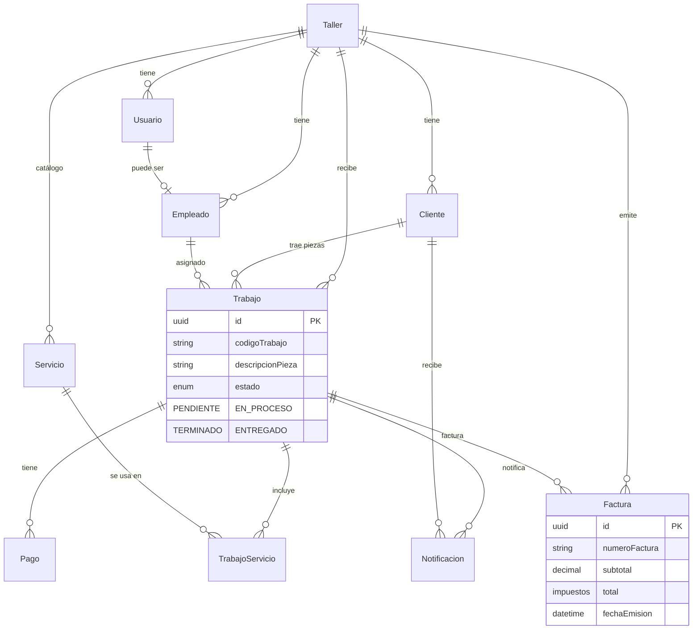
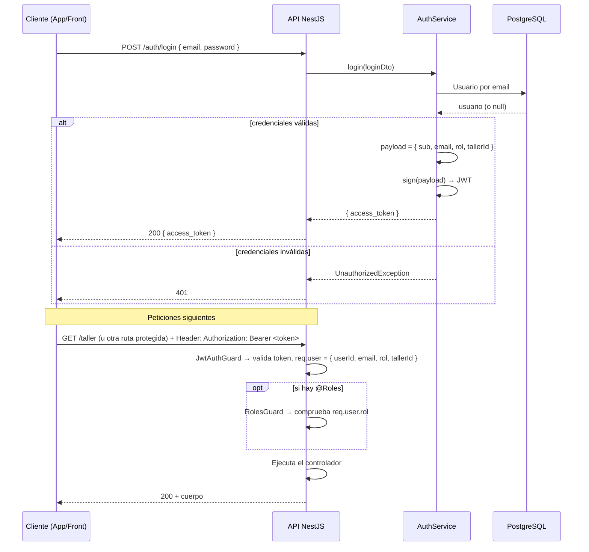
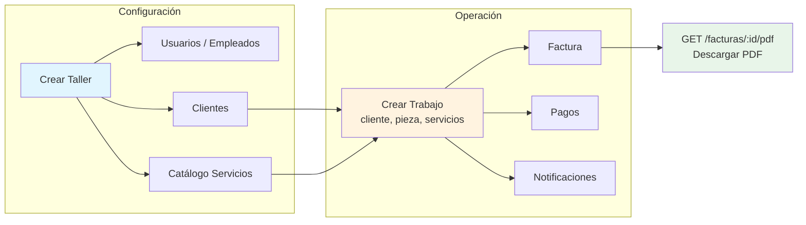

# SAS Taller – Esquema de funcionalidad y flujo de la API

Documento de referencia: módulos, rutas, modelo de datos y flujos de trabajo.

---

## 1. Arquitectura general

La API es una aplicación **NestJS** con **Prisma** (PostgreSQL). Está organizada por módulos; cada uno expone un recurso (taller, clientes, trabajo, etc.) y opcionalmente usa **Auth** (JWT + roles) para proteger rutas.

```
                    ┌─────────────────────────────────────────────────────────┐
                    │                      CLIENTE (Front / App)                │
                    └───────────────────────────┬─────────────────────────────┘
                                                 │
                    ┌────────────────────────────▼────────────────────────────┐
                    │  POST /auth/login  →  access_token (JWT)                │
                    │  Peticiones con:   Authorization: Bearer <token>        │
                    └────────────────────────────┬────────────────────────────┘
                                                 │
    ┌────────────────────────────────────────────▼────────────────────────────────────────────┐
    │                                    API NestJS (SAS Taller)                                │
    │  ┌──────────┐ ┌──────────┐ ┌──────────┐ ┌──────────┐ ┌──────────┐ ┌──────────┐ ...     │
    │  │  Taller  │ │ Usuarios │ │ Clientes │ │ Servicio │ │ Trabajo  │ │ Facturas │ │  Auth   │
    │  └────┬─────┘ └────┬─────┘ └────┬─────┘ └────┬─────┘ └────┬─────┘ └────┬─────┘ └────┬────┘
    │       │            │            │            │            │            │            │     │
    │       └────────────┴────────────┴────────────┴────────────┴────────────┴────────────┘     │
    │                                    PrismaService (ORM)                                    │
    └────────────────────────────────────────────┬─────────────────────────────────────────────┘
                                                 │
                    ┌────────────────────────────▼────────────────────────────┐
                    │                  PostgreSQL (sas_taller)                │
                    └────────────────────────────────────────────────────────┘
```

---

## 2. Modelo de datos (relaciones entre entidades)

El **taller** es la raíz: todo pertenece a un taller. Un **trabajo** es la pieza que entra; se asocia a un cliente, opcionalmente a un empleado, y a varios **servicios** (tabla intermedia TrabajoServicio). De un trabajo se generan **facturas**, **pagos** y **notificaciones**.



---

## 3. Rutas de la API (resumen)

| Módulo        | Prefijo       | Métodos principales | Notas |
|---------------|---------------|--------------------|--------|
| **Auth**      | `POST /auth`  | `POST /auth/login` | Login → JWT. Sin guard. |
| **Taller**    | `/taller`     | GET, GET/:id, POST, PUT/:id, DELETE/:id | POST/PUT/DELETE: solo **SUPER_ADMIN** (guards). |
| **Usuarios**  | `/usuarios`   | GET, GET/:id, POST, PUT/:id, DELETE | Query: tallerId. |
| **Empleados** | `/empleados`  | GET, GET/:id, POST, PUT/:id, DELETE | Query: tallerId. |
| **Clientes**  | `/clientes`  | GET, GET/:id, POST, PUT/:id, DELETE | Query: tallerId. |
| **Servicio**  | `/servicio`   | GET, GET/:id, POST, PATCH/:id, DELETE | GET query: tallerId, soloActivos. DELETE = soft delete (activo=false). Código auto por nombre. |
| **Trabajo**   | `/trabajo`    | GET, GET/:id, POST, PATCH/:id, DELETE | Trabajo = pieza; relación con cliente, empleado, servicios. |
| **Pagos**     | `/pagos`      | GET, GET/:id, POST, PATCH/:id, DELETE | Por trabajoId. |
| **Facturas**  | `/facturas`   | GET, GET/:id, POST, PATCH/:id, DELETE, **GET/:id/pdf** | GET/:id/pdf → descarga PDF de la factura. |
| **Notificaciones** | `/notificaciones` | GET, GET/:id, POST, PATCH/:id, DELETE | Historial WhatsApp/email. |

- **Base URL**: `http://localhost:3000` (o la que uses).
- **Documentación Swagger**: `http://localhost:3000/api`.

---

## 4. Flujo de autenticación



---

## 5. Flujo de trabajo de negocio (taller → factura → PDF)

Flujo típico: dar de alta el taller, clientes y servicios; registrar la pieza (trabajo) con sus servicios; emitir factura y descargar PDF; registrar pagos y notificaciones.



### Pasos resumidos

1. **Configuración (por taller)**  
   - Crear **taller** (solo **SUPER_ADMIN**).  
   - Dar de alta **usuarios** (y opcionalmente **empleados** vinculados).  
   - Dar de alta **clientes**.  
   - Dar de alta **servicios** (código se genera automáticamente desde el nombre).

2. **Operación**  
   - **Crear trabajo**: cliente, descripción de pieza, código de trabajo; asociar **servicios** del catálogo (TrabajoServicio: cantidad, precio).  
   - **Crear factura** para ese trabajo (subtotal, impuestos, total, número, fecha).  
   - **Descargar PDF**: `GET /facturas/:id/pdf` (id = id de la factura).  
   - **Registrar pagos** del trabajo (monto, método, estado).  
   - **Registrar notificaciones** (cliente, trabajo, tipo EMAIL/WHATSAPP, mensaje, enviado).

3. **Estados del trabajo**  
   PENDIENTE → EN_PROCESO → TERMINADO → ENTREGADO (útil para filtros y reportes).

---

## 6. Seguridad (guards y roles)

| Recurso        | Uso |
|----------------|-----|
| **JwtAuthGuard** | Rutas que exigen login. Sin token → 401. |
| **RolesGuard**   | Rutas que exigen uno o más roles. Va después de JwtAuthGuard. |
| **@Roles(Rol.ADMIN)** | Solo ADMIN. |
| **@Roles(Rol.ADMIN, Rol.EMPLEADO)** | ADMIN o EMPLEADO. |

Módulos que usan guards deben **importar AuthModule**.  
Detalle: ver **docs/GUARDS-Y-ROLES.md**.

---

## 7. Funcionalidades destacadas

| Funcionalidad | Dónde | Descripción breve |
|---------------|--------|-------------------|
| Login JWT     | POST /auth/login | Devuelve `access_token` con sub, email, rol, tallerId. |
| Código de servicio automático | POST /servicio | Código generado desde el nombre (ej. "Rectificación de culata" → REC-CUL-01). |
| Soft delete de servicios | DELETE /servicio/:id | No borra; pone `activo = false`. |
| Factura en PDF | GET /facturas/:id/pdf | Genera PDF al vuelo (taller, cliente, trabajo, líneas de servicio, totales). |
| Validación DTO | Varios | class-validator + ValidationPipe (ej. clientes, servicios, facturas). |

---

## 8. Resumen visual del flujo de datos

```
                    TALLER (raíz)
                         │
     ┌───────────────────┼───────────────────┐
     │                   │                   │
  Usuarios          Clientes            Servicios
  Empleados              │                   │
     │                   │                   │
     └───────────────────┼───────────────────┘
                         │
                    TRABAJO (pieza)
                    cliente + empleado + serviciosEnTrabajo
                         │
     ┌───────────────────┼───────────────────┐
     │                   │                   │
  Facturas            Pagos          Notificaciones
     │
  GET :id/pdf → PDF
```

Este documento sirve como esquema de funcionalidad y flujo de la API para consulta futura y onboarding.
